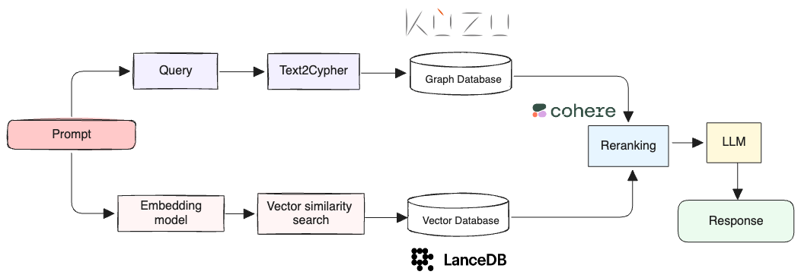

# Graph RAG and Hybrid RAG Workshop

Workshop on showing the benefits of Graph RAG and its combination with Vector RAG (Hybrid RAG).

The following stack is used:

- Graph database: [Kùzu](https://kuzudb.com/)
- Vector database: [LanceDB](https://lancedb.com/)
- LLM prompting: [ell](https://docs.ell.so/), a language model programming framework
- Embedding model: OpenAI `text-embedding-3-small`
- Entity & relationship extraction: [LlamaIndex](https://docs.llamaindex.ai/) + OpenAI `gpt-4o-mini`
- Generation model: OpenAI `gpt-4o-mini`
- Reranking: Cohere [reranker](https://docs.cohere.com/v2/reference/rerank)

The system we'll be building has the following high-level architecture:



## Dataset

The dataset used in this workshop is the [BlackRock founders dataset](./data/blackrock), which
are three small text files containing information about the founders of the asset management firm
BlackRock.

The aim of the workshop is to show how we can build a hybrid RAG system that utilizes a graph
database and a vector database to answer questions about the dataset.

## Setup environment

We will be using the Python API of Kùzu and a combination of scripts that utilize the required
dependencies.

### `uv` package manager

It's recommended to use Astral's [`uv` package manager](https://docs.astral.sh/uv/) to manage both
Python and its dependencies. You can install the required version of Python (3.12) using `uv` with
the following command:

```bash
uv python install 3.12
```

All the dependencies are indicated in the `pyproject.toml` file and the associated `uv.lock` file
provided in this repo. Simply sync the dependencies to your local virtual environment with the
following command:

```bash
# Sync dependencies and allow uv to create a local .venv
uv sync

# Run scripts
uv run crud.py
uv run graph_rag.py
uv run vector_rag.py
uv run hybrid_rag.py
```


### If using system Python

> [!NOTE]
> Alternatively you can use your system's Python installation and pip to install the dependencies
> via `requirements.txt`.

```bash
# Activate virtual environment
python -m venv .venv
source .venv/bin/activate
python -m pip install -r requirements.txt

# Run scripts
python crud.py
python graph_rag.py
python vector_rag.py
python hybrid_rag.py
```

## Description of steps

### 1. Construct the graph

The script `crud.py` extracts entities and relationships from the provided
[BlackRock founders dataset](./data/blackrock) and constructs a graph that is stored in Kùzu.

```bash
uv run crud.py
```

The script `crud.py` does the following:
- Chunk the text, generate embeddings, and stores the embeddings in a [LanceDB](https://lancedb.com/),
an embedded vector database
- Use the LlamaIndex framework and its
[property graph index](https://docs.llamaindex.ai/en/stable/module_guides/indexing/lpg_index_guide/)
to extract entities and relationships from the unstructured text.
- Store the extracted entities and relationships in Kùzu, an embedded graph database
- Augment the graph with additional entities and relationships obtained from external sources

### 2. Traditional RAG (via vector search)

The script `vector_rag.py` runs retrieval-augmented generation (RAG) that leverages semantic
(vector) search. To retrieve from the vector database, the script first embeds the question and then
searches for the nearest neighbors using cosine similarity. It then retrieves the context (chunks of
text) that are most similar to the question. The script finally uses the LLM to generate a response
using the retrieved context.

```bash
uv run vector_rag.py
```

### 3. Graph RAG

The script `graph_rag.py` runs retrieval-augmented generation (RAG) that leverages the graph
database to answer questions. To retrieve from the graph database, the script first translates
the question into a Cypher query, which is then executed against the graph database. The retrieved
entities and relationships are then used as context to generate a response using the LLM.

```bash
uv run graph_rag.py
```

### 4. Hybrid RAG

The script `hybrid_rag.py` runs retrieval-augmented generation (RAG) that leverages *both* the
vector database and the graph database. The vector and graph retrieval contexts are concatenated
together and passed to the LLM to generate a response.

```bash
uv run hybrid_rag.py
```

## Workshop exercises

In this section, we'll go through the workshop exercises.

### 1. Traditional RAG

You can use the script `vector_rag.py`, that performs naive chunking of the text, creates vector
embeddings of the chunks, and stores them in a vector database.

We'll answer the following questions using traditional RAG.

#### Q1: Who are the founders of BlackRock? Return the names as a numbered list.
```
The founders of BlackRock are:

1. Larry Fink
2. Robert Kapito
3. Susan Wagner
```

> [!NOTE]
> The above list of the BlackRock founders is not exhaustive. Five more cofounders exist, as is
> revealed in a simple Google search. To address this, you can augment the graph (in the next step) with the additional information to improve the relevance and factual accuracy of the response.

#### Q2: Where did Larry Fink graduate from?
```
Larry Fink graduated from UCLA, where he earned a BA in political science in 1974 and an MBA in 1976.
```

#### Q3: When was Susan Wagner born?
```
The relevant context does not provide information about Susan Wagner's birth date. Therefore, I cannot answer the question about when Susan Wagner was born.
```

> [!NOTE]
> In the given text data, Susan Wagner's birth date is not mentioned. You can use a graph
> with the additional information added in it to improve the relevance and factual accuracy of the response.

#### Q4: How did Larry Fink and Rob Kapito meet?
```
Larry Fink and Rob Kapito first met while working at First Boston in 1979, where Kapito served in the Public Finance department. This initial meeting laid the foundation for their future partnership when they later co-founded BlackRock in 1988.
```

### 2. Graph RAG

You can use the script `graph_rag.py` to answer the following questions using graph RAG. During
graph construction, we added additional cofounders of BlackRock to the graph, as well as some of
their birth dates.

Just like earlier, we'll answer the following questions using Graph RAG.

#### Q1: Who are the founders of BlackRock? Return the names as a numbered list.
```
1. Barbara Novick  
2. Hugh Frater  
3. Keith Anderson  
4. Ralph Schlosstein  
5. Robert Kapito  
6. Larry Fink  
7. Ben Golub  
8. Susan Wagner  
```

> [!NOTE]
> Because we augmented the graph with external knowledge, the list of founders is now exhaustive.

#### Q2: Where did Larry Fink graduate from?

```
Larry Fink graduated from UCLA.
```

> [!NOTE]
> Unlike vector retrieval-based RAG, the graph only stored the name of the university that Larry Fink
> graduated from, so the LLM only has this context to answer the question as it did.

#### Q3: When was Susan Wagner born?

```
Susan Wagner was born on May 26, 1961.
```

> [!NOTE]
> The graph stored the birth dates of Larry Fink and Susan Wagner, so the LLM was able to answer the
> question correctly where the vector search did not.

#### Q4: How did Larry Fink and Rob Kapito meet?

```
The relevant context does not provide any information about how Larry Fink and Rob Kapito met. Therefore, I cannot answer the question.
```

> [!NOTE]
> The graph did not store any information about how Larry Fink and Rob Kapito met, so the LLM
> was unable to answer the question in this case.


### 3. Hybrid RAG

You can use the script `hybrid_rag.py` to answer the following questions using hybrid RAG. The two
retrieval contexts (vector and graph) are concatenated together and passed to the LLM to generate
a response.

#### Q1: Who are the founders of BlackRock? Return the names as a numbered list.
```
The founders of BlackRock are:

1. Barbara Novick  
2. Hugh Frater  
3. Keith Anderson  
4. Ralph Schlosstein  
5. Robert Kapito  
6. Larry Fink  
7. Ben Golub  
8. Susan Wagner  
```

#### Q2: Where did Larry Fink graduate from?

```
Larry Fink graduated from UCLA, where he earned both a BA in political science in 1974 and an MBA in 1976.
```

#### Q3: When was Susan Wagner born?

```
Susan Wagner was born on May 26, 1961.
```

#### Q4: How did Larry Fink and Rob Kapito meet?

```
Larry Fink and Rob Kapito first met while working at First Boston in 1979, where Kapito served in the Public Finance department. This meeting marked the beginning of their professional relationship, which later led them to become partners in founding BlackRock in 1988.
```

## Additional exercises

- Try to answer questions about data that is not present in the original text. For example, you
can try to ask "When was Barbara Novick born?"
- Try to answer questions that require some commonsense reasoning based on the text provided.
For example, "Does Susan Wagner still work at BlackRock?"
- Try to answer questions that require reasoning over multiple sentences. For example, "Which of
BlackRock's cofounders also worked at First Boston, and where were they born?"


## Conclusions

The hybrid RAG methodology (with reranking) provides factually accurate
responses in all four cases. In cases where the graph didn't contain the answer, the vector search
provided relevant context that allowed the LLM to generate a response. In cases where the graph
contained the answer but the raw text didn't, hybrid RAG was able to rerank the results from the
graph and vector search in way that on average, provided relevant responses.

Note that the hybrid RAG system is not perfect. If the information is not present (either explicitly
or implicitly in the text), it cannot provide an answer to the question because the LLM cannot
reason over the required information to formulate a response.

The key takeaways are:
- Graphs can be a helpful tool for factual (extractive) question-answering tasks in RAG
- Traditional RAG (vector-based) is useful for abstractive question-answering tasks, where the
information is not explicitly stated in the exact words of the question
- Just like data quality is of paramount importance in any retrieval system, for hybrid or Graph
RAG, the quality of the graph (entities and relationships) is crucial to the quality of the responses
generated

Feel free to clone/fork this repo and try out the workflow on your own datasets!